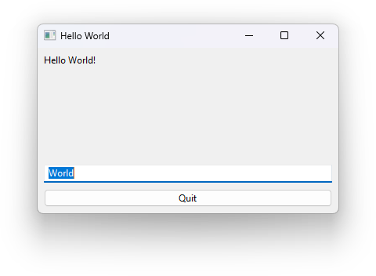
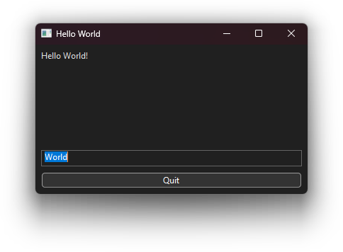

# Windows 11

## Accessibility

- Keyboard navigation: Works
- Unicode support: Works
  - On Windows, the cursor in the input can move in between the codepoints of a graphme cluster. This is a limit of the native win32 inputs
- Screen reader support: Works (Tested with Narrator)
- Touch compatibility: Untested
- Gamepad compatibility: None

## Resource Usage / Start-up Time

Measured on an ASUS TUF Gaming F15 FX506HM with Windows 11.

- Size of executable: 11,2MiB (70KiB without dynamically linked dependencies)
- Ram Usage: 2.4MiB
- Startup time: 62ms (Measured with https://github.com/Trinity2019/WinWordStartupTime/)
